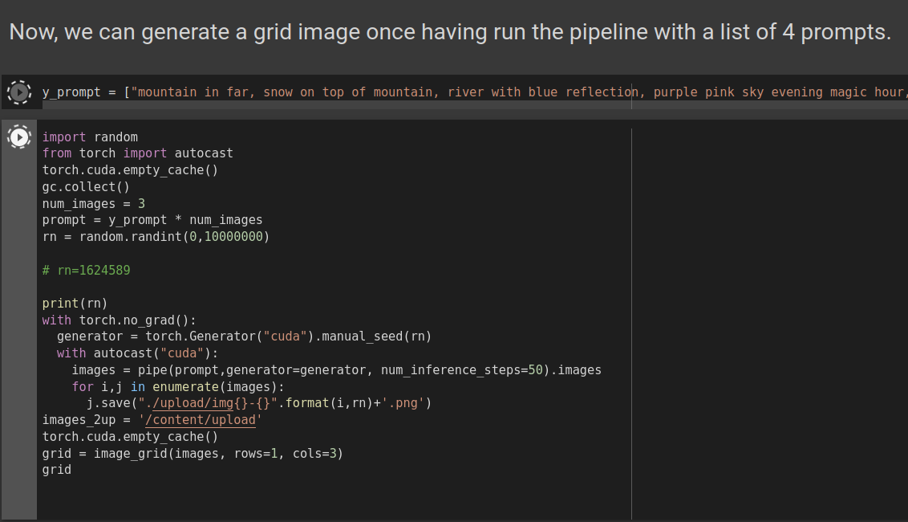
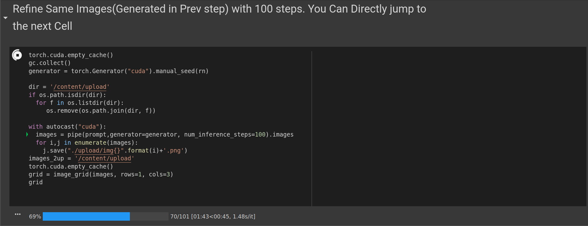
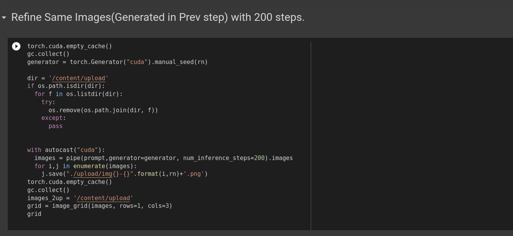
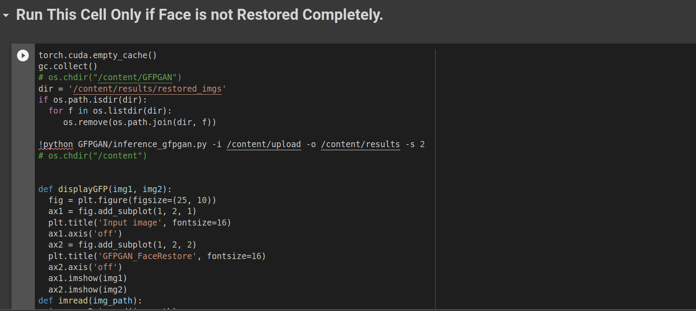
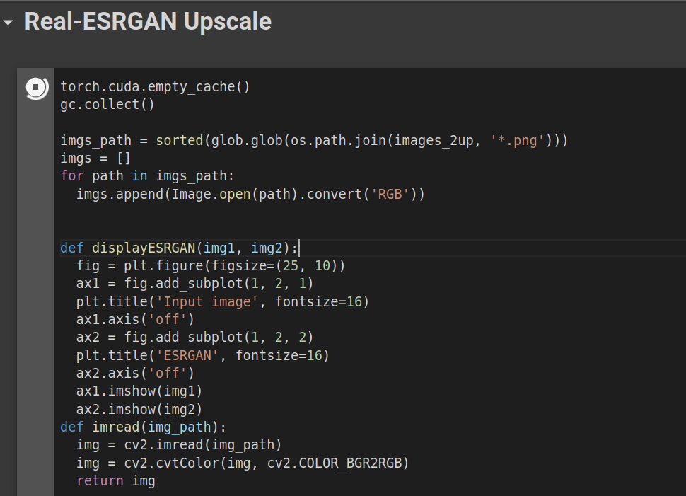

# **High Quality Text to Image Generation using Stable Diffusion, GFPGAN Face Restoration,Real-ESR and Swin IR**

Generate 4K and FULL HD Images and Artworks for Free Using Stable Diffusion. Don't Forget to give Start at Github and Support Original Authors too 😊.
Steps:-
1. Create Account at https://huggingface.co/ (don't worry it's easy 😅)
2. Visit https://huggingface.co/CompVis/stable-diffusion-v1-4 and down in the page tick the checkbox and then click submit.
3. Get Your Access Token from https://huggingface.co/settings/tokens and use it in 4th code cell of colab notebook.

Visit Logical Spot for Video Help:-

 
 
 After Running first 4 cells, You will going to see output like this.

click this link after creating account in [HuggingFace](https://huggingface.co/) to get your [HuggingFace Token](https://huggingface.co/settings/tokens). 

And Hit Login Button. If you don't have any token then create new token with write access.

Run All the cell until you Reach your Prompt cell.

Type your Prompt under this cell, inside ``["your prompt is here"]``. and hit ``Shift + Enter``, Run Next cell too to generate Images.
Run this cell as many as time you want, until you get your desired artwork. And here is my Results.

If Stable Diffusion generate something off in image, Dont't Worry!! Run next cell or if you already got satisfied result you may **leave next two cell**. But here is what i got after running next cell.

Here you can only make difference between them if you look closely. You don't have to bother you notebook if you already got better result in first generation with 50 steps. just ignore this cell.
like i'm leaving this cell as it is.

and leaving this cell too cause these images don't have any human face. **Note: if your images have Human faces, then just run this cell too**.

 ***In case if you have any human face in your images then it will restore Distorted figures(like eyes,nose,etc) in images, here is example.***  **In Stable Diffusin her Eyes and Lips are bit distorted.**
 

Now it's time to upscale images to 2K or 4k using Real-ESR GAN.

after running this cell you will get a comparison matrix like this.

**Input Images --> Upscaled Images(Real-ESR)**

After Upscaling you images using Real-ESRGAN rest of the cell are optional to run and not recommended (Cause limited GPU RAM in Colab, After running these cell may be it will show you error like ``cuda out of memory``) to run until you are not satisfied with result of Upscaled images of Real-ESR.
right Now I am going to show you difference b/w both Upscalers.
Using both Optional cell at the last of notebook.

**Input Images ------ Upscaled Images(SwinIR) ----- Upscaled Images(RealESRGAN)**

 
 
 # **Stable Diffusion** 🎨 
*...using `🧨diffusers`*

Stable Diffusion is a text-to-image latent diffusion model created by the researchers and engineers from [CompVis](https://github.com/CompVis), [Stability AI](https://stability.ai/) and [LAION](https://laion.ai/). It's trained on 512x512 images from a subset of the [LAION-5B](https://laion.ai/blog/laion-5b/) database. This model uses a frozen CLIP ViT-L/14 text encoder to condition the model on text prompts. With its 860M UNet and 123M text encoder, the model is relatively lightweight and runs on a GPU with at least 10GB VRAM.
See the [model card](https://huggingface.co/CompVis/stable-diffusion) for more information.
This Colab notebook shows how to use Stable Diffusion with the 🤗 Hugging Face [🧨 Diffusers library](https://github.com/huggingface/diffusers) . 
https://github.com/CompVis/stable-diffusion

orignal-link to colab https://colab.research.google.com/github/huggingface/notebooks/blob/main/diffusers/stable_diffusion.ipynb

# **Real-ESRGAN**

Real-ESRGAN aims at developing Practical Algorithms for General Image/Video Restoration.We extend the powerful ESRGAN to a practical restoration application (namely, Real-ESRGAN), which is trained with pure synthetic data.

# **SwinIR**

SwinIR achieves state-of-the-art performance on six tasks: image super-resolution (including classical, lightweight and real-world image super-resolution), image denoising (including grayscale and color image denoising) and JPEG compression artifact reduction. See our [paper](https://arxiv.org/abs/2108.10257) and [project page](https://github.com/JingyunLiang/SwinIR) for detailed results.

### (No colorization; No CUDA extensions required)

## **GFPGAN** - Towards Real-World Blind Face Restoration with Generative Facial Prior

GFPGAN is a blind face restoration algorithm towards real-world face images.  
It leverages the generative face prior in a pre-trained GAN (*e.g.*, StyleGAN2) to restore realistic faces while precerving fidelity.  

