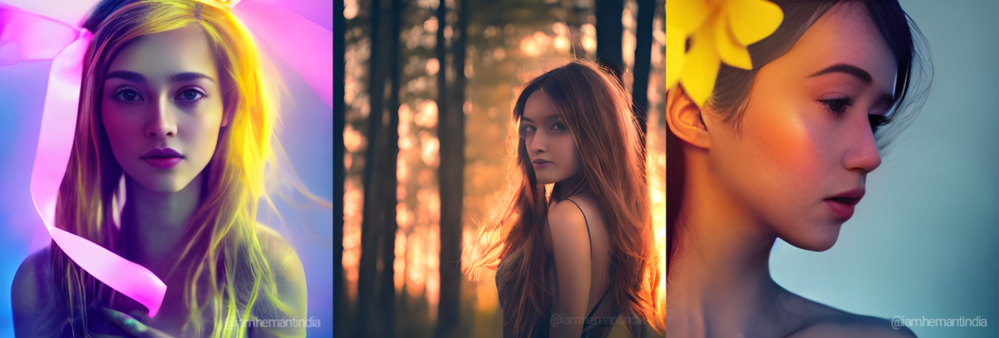

# **High Quality Text to Image Generation using Stable Diffusion, GFPGAN,Real-ESR and Swin IR**

Generate 4K and FULL HD Images and Artworks for Free Using Stable Diffusion.

## No Need to generate token key for genrating images from huggingface...
Link to Coalb Notebook 

For Upscale Only goto RealESR Notebook (4K Upscale)
 
Run All the cell until you Reach your Prompt cell.
 ***In case if you have any human face in your images then it will restore Distorted figures(like eyes,nose,etc) in images, here is example.***  **In Stable Diffusin her Eyes and Lips are bit distorted.**
 

To upscale images to 2K or 4k using Real-ESR GAN. Note that after running Reasl-ESRGAN leave SwinIR until unless you are not satisfied with RealESR results.

after running this cell you will get a comparison matrix like this.

**Input Images --> Upscaled Images(Real-ESR)**

After Upscaling you images using Real-ESRGAN rest of the cell are optional to run and not recommended (Cause limited GPU RAM in Colab, After running these cell may be it will show you error like ``cuda out of memory``) to run until you are not satisfied with result of Upscaled images of Real-ESR.
right Now I am going to show you difference b/w both Upscalers.
Using both Optional cell at the last of notebook. (It may full your current colab RAM)

**Input Images ------ Upscaled Images(SwinIR) ----- Upscaled Images(RealESRGAN)**

Visit Logical Spot for Video Help:-

 
 
 
 # **Stable Diffusion** 🎨 
*...using `🧨diffusers`*

Stable Diffusion is a text-to-image latent diffusion model created by the researchers and engineers from [CompVis](https://github.com/CompVis), [Stability AI](https://stability.ai/) and [LAION](https://laion.ai/). It's trained on 512x512 images from a subset of the [LAION-5B](https://laion.ai/blog/laion-5b/) database. This model uses a frozen CLIP ViT-L/14 text encoder to condition the model on text prompts. With its 860M UNet and 123M text encoder, the model is relatively lightweight and runs on a GPU with at least 10GB VRAM.
See the [model card](https://huggingface.co/CompVis/stable-diffusion) for more information.
This Colab notebook shows how to use Stable Diffusion with the 🤗 Hugging Face [🧨 Diffusers library](https://github.com/huggingface/diffusers) . 
https://github.com/CompVis/stable-diffusion

orignal-link to colab https://colab.research.google.com/github/huggingface/notebooks/blob/main/diffusers/stable_diffusion.ipynb

# **Real-ESRGAN**

 

Real-ESRGAN aims at developing Practical Algorithms for General Image/Video Restoration.We extend the powerful ESRGAN to a practical restoration application (namely, Real-ESRGAN), which is trained with pure synthetic data.

# **SwinIR**

SwinIR achieves state-of-the-art performance on six tasks: image super-resolution (including classical, lightweight and real-world image super-resolution), image denoising (including grayscale and color image denoising) and JPEG compression artifact reduction. See our [paper](https://arxiv.org/abs/2108.10257) and [project page](https://github.com/JingyunLiang/SwinIR) for detailed results.

### (No colorization; No CUDA extensions required)

## **GFPGAN** - Towards Real-World Blind Face Restoration with Generative Facial Prior

GFPGAN is a blind face restoration algorithm towards real-world face images.  
It leverages the generative face prior in a pre-trained GAN (*e.g.*, StyleGAN2) to restore realistic faces while precerving fidelity.  

